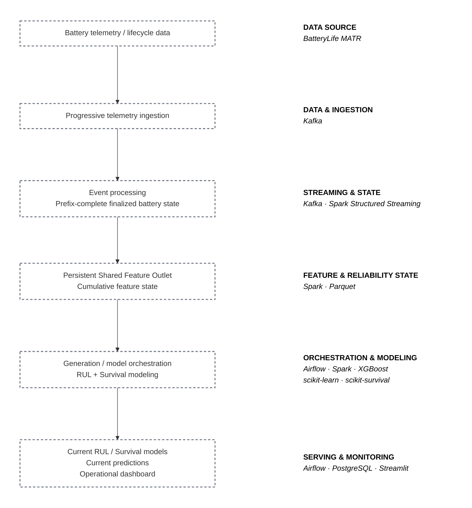

# Automated Battery Reliability & Predictive Analytics Platform

An end-to-end platform that retrains and evaluates RUL and Survival models as progressive telemetry arrives, serves Current models, and powers real-time fleet and battery monitoring. It maintains incremental feature state without rebuilding history; BatteryLife MATR simulates production telemetry, with 130M+ measurements as supporting scale.

## Highlights

- Automatically retrains and evaluates RUL and Survival models as new telemetry arrives.
- Serves Current models and predictions through PostgreSQL and a Streamlit dashboard.
- Monitors fleet risk and individual battery health in real time.
- Appends incremental feature state to the Shared Feature Outlet without rebuilding history.

## Dashboard

The working Streamlit dashboard covers fleet risk, battery detail, RUL model monitoring, and Survival model monitoring.

<!-- TODO: add a real dashboard screenshot from a verified run; do not use a synthetic image. -->

## Architecture



**[View the detailed architecture →](docs/architecture.md)**

## Model Performance

### RUL fixed-test results

| Generation | Selected family | Arrived cohort | MAE (cycles) | RMSE (cycles) | R² |
|---|---:|---:|---:|---:|---:|
| 1.0 | MLP | 26 | 98.04 | 150.27 | 0.6684 |
| 1.1 | XGBoost | 51 | 46.71 | 71.77 | 0.9244 |
| 1.2 | XGBoost | 76 | 40.91 | 63.85 | 0.9401 |
| 1.3 | XGBoost | 94 | 39.41 | 62.59 | 0.9425 |

### Survival fixed-test results

| Generation | Selected family | Arrived cohort | Integrated Brier ↓ | IPCW C-index ↑ |
|---|---:|---:|---:|---:|
| 1.0 | RSF | 26 | 0.02397 | 0.8372 |
| 1.1 | RSF | 51 | 0.02101 | 0.7923 |
| 1.2 | RSF | 76 | 0.01929 | 0.8199 |
| 1.3 | RSF | 94 | 0.01966 | 0.8349 |

MAE/RMSE and integrated Brier are lower-is-better; R² and IPCW C-index are higher-is-better. Validation selects model family/configuration; the fixed test set is held out from training and selection.

## How It Works

1. Deterministic MATR cycle and lifecycle data are replayed through Kafka.
2. Spark Structured Streaming finalizes prefix-complete cycles and appends rows to the persistent Shared Feature Outlet.
3. Airflow trains and evaluates RUL and Survival generation models from that shared outlet.
4. Selected Current models publish predictions to PostgreSQL, where the Dashboard reads them for monitoring.

## Tech Stack

Python · PySpark · Kafka · Spark Structured Streaming · Airflow · PostgreSQL · XGBoost · scikit-learn · scikit-survival · Streamlit · Docker

## Setup

```sh
cp .env.example .env
python scripts/preflight.py --profile full --tracked
```

The setup commands only prepare and validate the local environment; they do not run the full platform.

**Run the Full Platform → [docs/environment.md](docs/environment.md)**

## Data & Evaluation

BatteryLife MATR is the laboratory data source used to simulate progressive telemetry; this project is not a live production-telemetry system. The canonical cohort contains 169 batteries, including 101 training, 34 validation, and 34 test batteries. Validation and test batteries are excluded from training; validation selects models, while the fixed test benchmark is held out for final reporting.

## Scope / License

This is a reproducible laboratory-data demonstration of battery reliability and predictive analytics, not a production deployment. The MIT License covers this repository's code. BatteryLife/MATR archives and labels are externally sourced and remain subject to their original provider/source terms.
