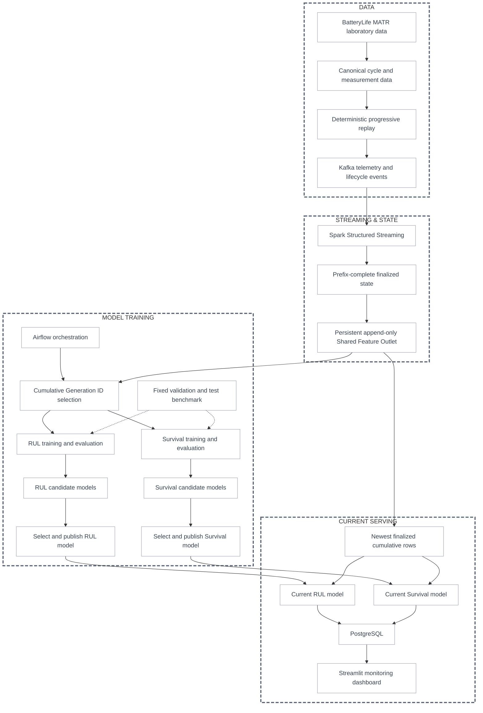

# Battery Reliability & Predictive Analytics Platform

An end-to-end battery reliability and predictive analytics platform that processes progressive telemetry into time-consistent battery health state, RUL and survival predictions, and operational monitoring. BatteryLife MATR laboratory data is replayed through Kafka to simulate progressive real-world battery telemetry and lifecycle arrival for reproducible development and evaluation; this repository does not receive live production telemetry.

The MIT License covers this repository's project code. Externally sourced BatteryLife/MATR archives and labels are not covered by this license; obtain and use them under their original source/provider terms.

## Results at a Glance

Evaluation uses the canonical BatteryLife MATR laboratory corpus (169 batteries, 140,001 cycles, and 130,573,638 measurements). The fixed benchmark is held out from training and generation-cutoff selection.

### RUL fixed-test results

| Generation | Selected family | Arrived cohort | MAE (cycles) | RMSE (cycles) | R² |
|---|---:|---:|---:|---:|---:|
| 1.0 | MLP | 26 | 98.04 | 150.27 | 0.6684 |
| 1.1 | XGBoost | 51 | 46.71 | 71.77 | 0.9244 |
| 1.2 | XGBoost | 76 | 40.91 | 63.85 | 0.9401 |
| 1.3 | XGBoost | 94 | 39.41 | 62.59 | 0.9425 |

### Survival fixed-test results

| Generation | Selected family | Arrived cohort | Integrated Brier ↓ | IPCW C-index ↑ |
|---|---:|---:|---:|---:|
| 1.0 | RSF | 26 | 0.02397 | 0.8372 |
| 1.1 | RSF | 51 | 0.02101 | 0.7923 |
| 1.2 | RSF | 76 | 0.01929 | 0.8199 |
| 1.3 | RSF | 94 | 0.01966 | 0.8349 |

MAE/RMSE and integrated Brier are lower-is-better; R² and IPCW C-index are higher-is-better. Model-family selection uses validation data only.

## Architecture



The Shared Feature Outlet is the common upstream outlet for both model families and current inference. New finalized cycle rows are appended once. Generation *N* consumes all outlet rows with `generation_id <= N`; RUL and Survival then apply their own labels, event semantics, and model-specific transformations to the same selected rows.

## Progressive Telemetry Simulation

BatteryLife MATR is the current laboratory source used to exercise the platform. Its canonical cycle and measurement data are replayed progressively through Kafka, with lifecycle events and cycle-completion boundaries preserved in time order. Spark streaming deduplicates events and admits only prefix-complete cycles, preventing later telemetry from changing an earlier finalized state.

## Modeling and Evaluation

State-bound features use only the current cycle and prior finalized history. RUL predicts remaining cycles to the source-supported approximately 80% SOH endpoint. Survival models estimate event and censoring behavior over time using Cox proportional hazards and Random Survival Forest candidates.

The platform evaluates multiple candidate families against a fixed, immutable benchmark of 34 validation batteries and 34 test batteries. Validation selects a family/configuration; the fixed test set is evaluated once for the selected winner and is never used for training or streaming cutoff selection.

## Generation IDs and Continuous Training

Airflow validates the finalized state, selects the cumulative shared-outlet rows for a generation, and fans those same rows out to parallel RUL and Survival training. A later generation appends only newly finalized rows; it does not rebuild or copy the historical feature dataset. Existing candidate models remain immutable, while Current Model selections are managed independently.

## Dashboard and Operational Use

PostgreSQL is the serving boundary for current RUL and Survival predictions, state availability, and model health. The Streamlit dashboard provides battery-level detail, current health and RUL views, survival horizons, cohort context, and operational model status. Candidate and historical predictions remain available for comparison and audit.

## Quick Start

The supported environment is Python **>=3.10,<3.14**, Java **>=17**, Docker Compose with the required Compose Specification capabilities, and Linux containers. Use Docker Desktop on macOS; use Docker Desktop with WSL2 and a checkout in the WSL filesystem on Windows. See [the environment guide](docs/environment.md) for prerequisites, data acquisition, service URLs, and clean-clone commands.

```sh
cp .env.example .env
python scripts/preflight.py --profile full --tracked
python src/normalize_matr.py
python src/matr_qc.py
docker compose up -d postgres kafka spark-master spark-worker-1 spark-worker-2 airflow
python src/kafka_producer.py
docker compose run --rm spark-stream-submit
python src/build_offline_benchmark.py
```

First obtain and checksum the pinned BatteryLife MATR archives, then follow the model-training, deterministic Current-selection, explicit serving-refresh, PostgreSQL-loading, and Dashboard checks in [the environment guide](docs/environment.md). Spark Streaming is the only canonical producer of finalized state and the Shared Feature Outlet.

## Scope and Limitations

This is a reproducible laboratory-data demonstration, not a live field-telemetry deployment. Kafka replay simulates progressive arrival deterministically; it does not represent production network behavior or field coverage. Results depend on the current laboratory cohort, feature contract, and benchmark definitions. The complete demonstration includes RUL, conditional Survival, parallel training, PostgreSQL serving, a Linux `amd64` Survival runtime, and Streamlit monitoring.
