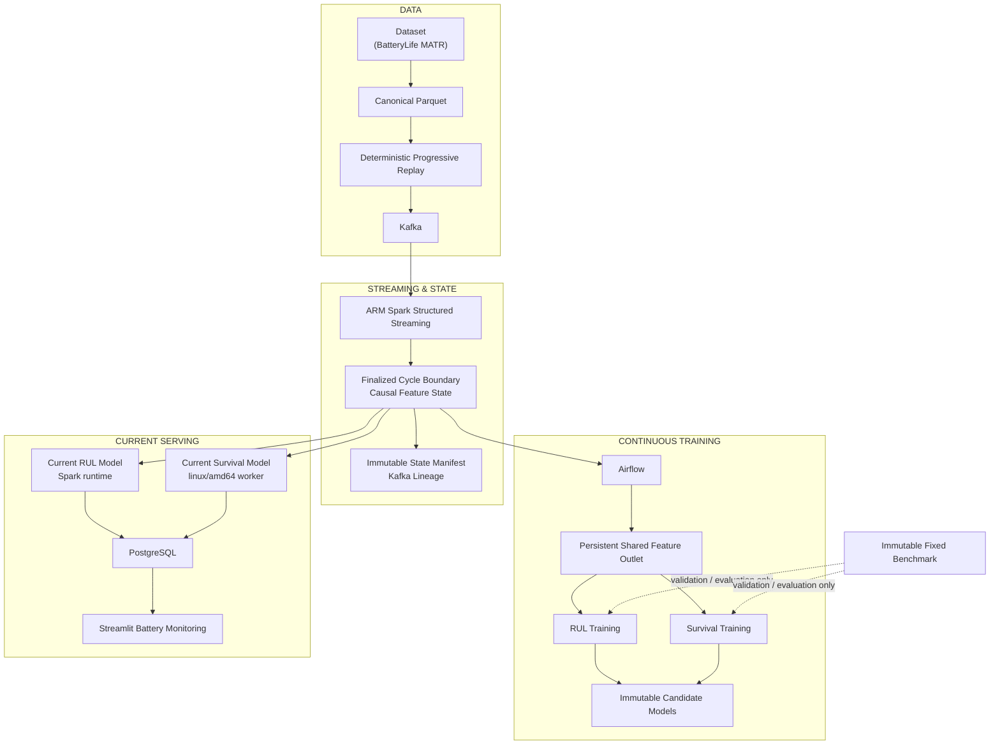

# Battery Reliability Platform

An end-to-end battery-health platform for the BatteryLife MATR dataset. It turns canonical telemetry into deterministic progressive-arrival Kafka replay, maintains a time-consistent Spark state, trains independent RUL and conditional-survival models, and serves operational results through PostgreSQL-backed Streamlit monitoring.

## Results at a Glance

The canonical MATR corpus contains 169 batteries, 140,001 cycles, and 130,573,638 measurements. Canonical v3 generations use the shared arrived-battery cohort and fixed offline benchmark.

### RUL fixed-test results

| Generation | Selected family | Arrived cohort | MAE (cycles) | RMSE (cycles) | R² |
|---|---:|---:|---:|---:|---:|
| 1.0 | MLP | 26 | 98.04 | 150.27 | 0.6684 |
| 1.1 | XGBoost | 51 | 46.71 | 71.77 | 0.9244 |
| 1.2 | XGBoost | 76 | 40.91 | 63.85 | 0.9401 |
| 1.3 | XGBoost | 94 | 39.41 | 62.59 | 0.9425 |

### Survival fixed-test results

| Generation | Selected family | Arrived cohort | Integrated Brier ↓ | IPCW C-index ↑ |
|---|---:|---:|---:|---:|
| 1.0 | RSF | 26 | 0.02397 | 0.8372 |
| 1.1 | RSF | 51 | 0.02101 | 0.7923 |
| 1.2 | RSF | 76 | 0.01929 | 0.8199 |
| 1.3 | RSF | 94 | 0.01966 | 0.8349 |

MAE/RMSE and integrated Brier are lower-is-better; R² and IPCW C-index are higher-is-better. Family/configuration selection is validation-only; the fixed test benchmark is evaluated only for the selected winner.

## Architecture



`latest.json` is an internal handoff for the latest finalized state. PostgreSQL is the serving boundary: Streamlit does not read manifests, state artifacts, Parquet, or model files directly.

## Data & Deterministic Replay

- The normalization step converts the source MATR archive to canonical Parquet.
- A deterministic progressive-arrival schedule orders batteries without using labels; generation snapshots occur when the arrived cohort reaches 26, 51, 76, or 94 batteries.
- The replay producer publishes telemetry before each matching `cycle_complete`, then lifecycle completion events. Kafka idempotence is enabled.
- Structured Streaming consumes `battery_measurements` and `battery_lifecycle`, deduplicates events, and preserves source topic/partition/offset watermarks.

## Time-Consistent State

Only prefix-complete cycles whose telemetry count matches their `cycle_complete` event enter the compact finalized boundary. New cycle features are appended once to the persistent shared outlet; future cycles cannot alter earlier rows or enter an earlier state selection. The immutable manifest records canonical replay fingerprints plus Kafka lineage.

One shared feature contract owns aggregation, causal history windows, feature ordering, null handling, and imputation semantics. The outlet stores only derived features keyed by dataset, battery, and cycle; canonical cycle facts and labels remain in `cycle_summary` and are joined by key.

## Modeling & Experiment Design

`SOH` is discharge capacity normalized to the MATR nominal-capacity convention (1.1 Ah; source normalization also accounts for the SOC width). The source-supported EOL is approximately 80% SOH. RUL is remaining cycles to EOL.

RUL trains Ridge, Random Forest, XGBoost, and MLP candidates from manifest-bound train features and observable supervised EOL labels. Survival trains Cox proportional hazards and Random Survival Forest models from event/right-censored histories; training uses the accepted stride-10 landmark sampling while validation and test retain their complete evaluation semantics.

The immutable fixed offline benchmark contains 34 validation batteries (29,718 complete rows) and 34 test batteries (24,709 complete rows), with lineage memberships, labels, split metadata, and content hashes. It is never used for training, streaming inference, or generation-cutoff filtering.

Older shared-state snapshots, the stale linear retraining DAG, legacy ARM Survival orchestration, and mutable latest-candidate pointers remain audit/test material, not canonical production flow.

## Continuous Training

Airflow runs the shared-generation DAG:

```text
validate shared state/receipt
  → select cumulative shared-outlet rows for the generation
  → parallel RUL training/evaluation  ||  parallel Survival training/evaluation
  → independent candidate publish/load
```

Both branches receive the same receipt-bound cumulative rows, state cutoff, feature contract, source identity, and arrived cohort before applying family-specific label/event logic. New generations append only newly finalized cycles; they do not recreate historical feature snapshots. Existing receipt-v2 snapshots remain readable for existing models. Each branch writes its own immutable generation artifacts, and candidate publication never changes either manually selected Current Model.

## Serving & Monitoring

- `analytics.current_models` and `analytics.current_survival_models` are independent dataset-scoped selections.
- Spark current RUL inference and the amd64 `survival-serving` worker score only the newest finalized cycle for each eligible non-benchmark battery.
- Current predictions are monotonic upserts into PostgreSQL; state and selection ordering prevent stale overwrites.
- RUL retains raw predictions, serves nonnegative constrained RUL, and enforces irreversible/frozen predicted EOL. Survival serves the 0–200 cycle grid with `S(0)=1`, finite bounded non-increasing probabilities, and exact +50/+100/+200 horizons.
- PostgreSQL serving-status tables expose finalized-state availability and RUL/Survival health. Streamlit Battery Detail shows operational Survival only when the current state and selected model match a served status; there is no candidate-artifact fallback.
- Immutable candidate/history predictions remain available for comparison and audit.

## Running the Project

The unified project environment is **Python >=3.10,<3.14, Java >=17, a Docker
Compose CLI >=2.0 with the required Compose Specification capabilities, and Linux containers**. Use Docker Desktop on macOS and Docker Desktop
with WSL2 on Windows. Follow [the clean-clone setup and test commands](docs/environment.md)
before starting services. Desktop full-stack verification remains a manual release
gate; the CI matrix defines the automated evidence, not a claim that it has already run.

```sh
python scripts/preflight.py --profile compose
```

Profiles select checks; every profile enforces the same project Python range.

1. Install the Python development requirements and configure `.env` from the supplied example.
2. Validate the compose graph with `docker compose config` and start the platform with `docker compose up -d`.
3. Normalize MATR data, create the deterministic arrival manifest, and publish the bounded replay with the repository scripts under `src/`.
4. Start `spark-stream-submit` for the available-now Structured Streaming run. Inspect finalized artifacts and PostgreSQL serving/status tables.
5. Trigger `matr_shared_generation_retraining` from Airflow for a recorded generation receipt. The Survival training/serving images run as `linux/amd64`; the Spark image remains ARM and does not import scikit-survival.
6. Open Streamlit at the dashboard service port. Dashboard runtime reads are PostgreSQL-only.

Focused verification is available with the repository test suite, including feature-contract parity, stream-state lineage, serving monotonicity, worker behavior, and DAG/receipt idempotency tests.

## Scope & Limitations

This is a reproducible MATR laboratory platform, not a live field-telemetry deployment. Kafka replay is deterministic and simulated; the current stream state is an operational snapshot, not a guarantee of production field coverage. Results depend on the fixed cohort, feature contract, and benchmark definitions above. The canonical scope includes RUL plus conditional survival (Cox PH and Random Survival Forest), with parallel training, PostgreSQL serving, an amd64 Survival worker, and Streamlit monitoring.
