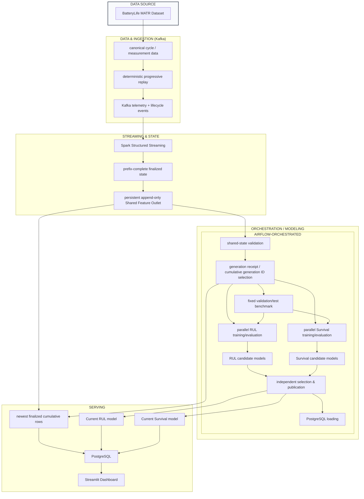

# Architecture Deep Dive

## Detailed flow notes

- Shared Feature Outlet is the common upstream state for both model families.
- Generations consume cumulative finalized rows for training and selection.
- RUL and Survival diverge only after shared-state generation selection.
- Validation (and fixed benchmark) selects candidate family/configuration; test remains held out.
- Current RUL and Current Survival selections are independent.
- PostgreSQL is the serving boundary consumed by Streamlit.
